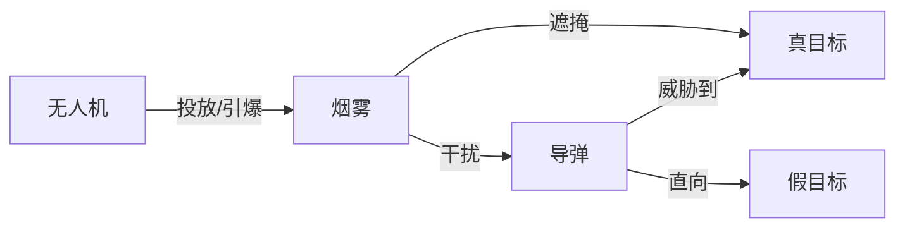

# A 题 烟幕干扰弹的投放策略

烟幕干扰弹主要通过化学燃烧或爆炸分散形成烟幕或气溶胶云团，在目标前方特定空域形成遮蔽，干扰敌方导弹，具有成本低、效费比高等优点。随着烟幕干扰技术的不断发展，现已有多种投放方式完成烟幕干扰弹的定点精确抛撒，即在抛撒前能精确控制烟幕干扰弹到达预定位置，通过时间引信时序控制起爆时间。

现考虑运用「无人机FY」完成「烟幕干扰弹(Smoke)」的投放策略问题。具有长续航能力的无人机挂载某型烟幕干扰弹在特定空域巡飞，受领任务后，无人机投放烟幕干扰弹在来袭武器和保护目标之间形成烟幕遮蔽。每架无人机投放两枚烟幕干扰弹至少间隔1s。

```python
fy_period = 1
```

* 烟幕干扰弹脱离无人机后，在重力作用下运动。烟幕干扰弹起爆后**瞬时**形成**球状**烟幕云团，
* 由于采用特定技术，该烟幕云团以3m/s的速度匀速下沉。
* 据试验数据知，云团中心10m范围内的烟幕浓度在起爆20s内可为目标提供有效遮蔽。

```python
smoke_velocity = np.array([0, 0, 3])
smoke_radius = 10
smoke_period = 20
```

来袭武器为「空地导弹(Missile)」，该型导弹飞行速度300m/s。导弹的飞行方向**直指**一个(为掩护某半径7m、高10m的圆柱形固定「目标(Real Target)」而专门设置的)「假目标(Fake Target)」。以假目标为原点，水平面为 𝑥𝑦平面，真目标下底面的圆心为 (0, 200, 0)。

```python
missile_speed = 300
```

```python
real_target_radius = 7
real_target_top = np.array([0, 200, 10])
real_target_button = np.array([0, 200, 0])
```

```python
fake_target = np.array([0, 0, 0])
```

警戒雷达发现来袭导弹时，3 枚导弹 M1、M2、M3 分别位于

```python
M1 = np.array([20000, 0, 2000])
M2 = np.array([19000, 600, 2100])
M3 = np.array([18000, -600, 1900])
```

5 架无人机的位置信息分别为

```python
FY1 = np.array([17800, 0, 1800])
FY2 = np.array([12000, 1400, 1400])
FY3 = np.array([6000, -3000, 700])
FY4 = np.array([11000, 2000, 1800])
FY5 = np.array([13000, -2000, 1300])
```

在导弹来袭过程中，通过投放烟幕干扰弹尽量避免来袭导弹发现真目标。控制中心在警戒雷达发现目标时，立即向无人机指派任务。无人机受领任务后， 可根据需要瞬时调整飞行方向，然后以 70~140 m/s 的速度等高度匀速直线飞行。每架无人机的航向、速度可不相同，但一旦确定就不再调整。

```python
fy_speed_min = 70
fy_speed_max = 140
```

为实现更为有效的烟幕干扰效果，需设计烟幕干扰弹的投放策略，主要包括无人机飞行方向、飞行速度、烟幕干扰弹投放点、烟幕干扰弹起爆点等。请建立数学模型，针对不同情形， 分别设计烟幕干扰弹的投放策略， 使得多枚烟幕干扰弹对真目标的有效遮蔽时间尽可能长。不同烟幕干扰弹的遮蔽可不连续。

## 建模

这个问题涉及到五个实体: 导弹, 无人机, 烟雾, 真目标, 假目标



其中无人机只对烟雾产生直接影响, 所以将问题拆分:

1. 导弹的位置
2. 无人机释放烟雾的时机, 位置
3. 烟雾, 导弹, 真目标的位置关系
4. 遮掩时间

### 导弹

* 令函数$\mu_i(t)$表示第$i$个导弹在$t$时刻的坐标.

### 无人机

可以设置的无人机的参数为: $ v_j, \theta_j, t_{jk}, t'_{jk} $

其中有约束

$$
\begin{cases}
v_{min}\le v< v_{max} \\
0 \le\theta<360^\circ \\
t_k+1 \le t_{k+1} \\
0 \le t_k \\
 0\le t'_k
\end{cases}
$$

* 令函数$\phi_j(t)$表示第$j$个无人机在$t$时刻的坐标.
* 令函数$\sigma_{jk}(t)$表示第$j$个无人机的第$k$个烟雾弹在$t$时刻的坐标.

### 烟雾, 导弹, 真目标的位置关系

关于烟雾, 导弹, 真目标的位置关系, 我们只关心「是否遮掩成功」.

* 定义: 任何连接某导弹和真目标的线段都经过某烟雾, 则称该烟雾遮掩了该导弹.

* 定义(等价): 若真目标包含在某导弹因某烟雾的盲区(圆锥)内, 则称该烟雾遮掩了该导弹.

* 定义: 复数烟雾中, 存在烟雾遮掩某导弹, 则称这些烟雾遮掩了该导弹.

* 定义: 复数导弹中, 任意导弹都被烟雾遮掩, 则称这些烟雾遮掩了这些导弹.

$\mathcal{M} = \{M_i\}_{i\le n},  \mathcal{S} = \{S_j\}_{j\le m} $

$ g(M, \mathcal{S})=\lor_{j\le m}g(M, S_j)$

$ g(\mathcal{M}, \mathcal{S})=\land_{i\le n}\lor_{j\le m}g(M_i, S_j) $

结论: 因为烟雾为球, 导弹为点, 所以导弹的视野盲区为圆锥.

结论: 真目标的顶面和底面都被某圆锥包含, 的充分必要条件是, 真目标被该圆锥包含.

### 遮掩时间

$$
S(t)=\mu(\vec{x}, v, \theta, t_k, t'_k, t)\\
\sigma(M, S)=[\argmin_{g(M, S(t))=1} t, \argmax_{g(M, S(t))=1} t] \\
\sigma(M, \mathcal{S})=\cup_{j\le m}\sigma(M, S_j) \\
\sigma(\mathcal{M}, \mathcal{S})=\cap_{i\le n}\cup_{j\le m}\sigma(M_i, S_j)
$$

$$


$$

$$
\lambda为\mathbb{R}上的Lebesgue测度\\
\lambda \circ \sigma(\mathcal{M}, \mathcal{S})为实际遮掩时间
$$

## 问题 1

利用无人机 FY1 投放 1 枚烟幕干扰弹实施对 M1 的干扰，若 FY1 以 120 m/s 的速度朝向假目标方向飞行，受领任务 1.5 s 后即投放 1 枚烟幕干扰弹，间隔 3.6 s 后起爆。请给出烟幕干扰弹对 M1 的有效遮蔽时长。

$$
\theta = ...\\
S_{11}(t)=\mu(F_1, 120, \theta, 1.5, 1.5+3.6, t)\\
\lambda\circ\sigma(M_1, S_{11})=?
$$

## 问题 2

利用无人机 FY1 投放 1 枚烟幕干扰弹实施对 M1 的干扰，确定 FY1 的飞行方向、飞行速度、烟幕干扰弹投放点、烟幕干扰弹起爆点，使得遮蔽时间尽可能长。

$$
S_{11}(t)=\mu(F_1, v,\theta,t_1,t'_1, t)\\
\argmax \lambda\circ \sigma(M_1, S_{11})=?
$$

## 问题 3

利用无人机 FY1 投放 3 枚烟幕干扰弹实施对 M1 的干扰。 请给出烟幕干扰弹的投放策略，并将结果保存到文件 result1.xlsx 中（模板文件见附件） 。

$$
\mathcal{S}=\{S_{1k}\}_{k\le3}\\
S_{1,k}(t)=\mu(F_1, v_1, \theta_1, t_{1k}, t_{1k}', t)\\
\argmax \lambda\circ\sigma(M_1, \mathcal{S})=?
$$

## 问题 4

利用 FY1、FY2、FY3 等 3 架无人机，各投放 1 枚烟幕干扰弹，实施对 M1 的干扰。请给出烟幕干扰弹的投放策略，并将结果保存到文件 result2.xlsx 中（模板文件见附件）.

$$
\mathcal{S}=\{S_{j1}\}_{j\le3}\\
S_{j1}(t)=\mu(F_j, v_j, \theta_j, t_{j1}, t_{j1}', t)\\
\argmax \lambda\circ\sigma(M_1, \mathcal{S})=?
$$

## 问题 5

利用 5 架无人机，每架无人机至多投放 3 枚烟幕干扰弹， 实施对 M1、 M2、 M3
等 3 枚来袭导弹的干扰。 请给出烟幕干扰弹的投放策略，并将结果保存到文件 result3.xlsx 中
（模板文件见附件）。

$$
\mathcal{M}=\{M_i\}_{i\le3}, \mathcal{S}=\{S_{jk}\}_{j\le5,k\le3}\\
S_{jk}(t)=\mu(F_j, v_j, \theta_j, t_{jk}, t_{jk}', t)\\
\argmax \lambda\circ\sigma(\mathcal{M}, \mathcal{S})=?
$$
